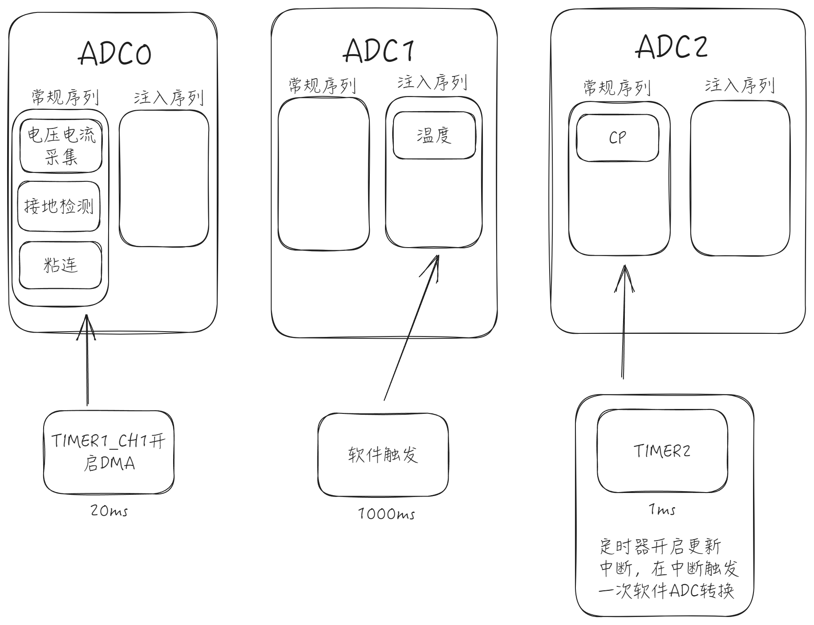

# 资源分配以及功能实现逻辑

## 按外设分

### GPIO

### 定时器

1. `TIMER1`: 交流信号采集。
2. `TIMER2`: CP输出。
3. `TIMER3`: 触发温度采集(尚未使用)。
4. `TIMER5`: S1二极管检测。
5. `TIMER6`: 延时函数的时基单元。

## ADC

交流部分和CP的采样都需要用到DMA传输，只有ADC0和ADC2的常规序列可以单独使用DMA传输，但是ADC2的常规序列只有四个通道，因此数量较多的AC采样部分放到了ADC0常规序列里面；CP采样放到ADC2里面。

- ADC0: 交流信号采集
  - CURRENT_ADC(`PA3`): L1输入电流。
  - VOL_IN_ADC(`PA4`): L1输入电压。
  - GNDING_ADC(`PA7`): PE检测。
- ADC1: NTC采样
  - NTC1_ADC: 插头的NTC
  - PLUG_ADC: 枪头的NTC, 目前没接
  - NTC0_ADC(`PB0`): 板载温度检测
- ADC2: CP采样
  - CP_ADC(`PA1`): CP检测

### 交流部分的ADC采样

ADC0常规序列。

1. FREQ_IN(`PB6`): 用来指示交流电的零点(上升沿表示一个周期的开始), 用来触发ADC采样
2. CURRENT_ADC(`PA3`): L1输入电。
3. VOL_IN_ADC(`PA4`): L1输入电压。
4. GNDING_ADC(`PA7`): PE检测。
5. `TIMER1`: 用来触发ADC采样。

有两种方案:

1. 固定频率采样
2. 不同频率采样

开启定时器, 定时器以`5000Hz`的频率来触发ADC采样, 对于`50Hz`的交流电来说, 一个周期就是100个采样点。同时开启ADC的DMA传输, DMA缓冲区的大小设置为100, 开启DMA全满中断, 当触发DMA全满中断的时候就说明一个周期采样完成了, 此时关闭定时器。

对于频率不固定的交流信号来说，可以使用`FREQ_IN`引脚来判断一个周期的开启和结束。第一次检测到`FREQ_IN`的上升沿，就开启定时器，第二次检测到`FREQ_IN`的上升沿，就关闭定时器。ADC同样开启DMA传输, 但是DMA缓冲区的大小要设置的大一点, 并且不开启中断。关闭定时器后, 处理DMA缓冲区的数据，缓冲区里的数量就是一个周期的采样点。

### 温度检测(暂定`ADC1`注入通道)

ADC1注入序列, 由软件触发。
2024/12/27补充: 采用注入组是因为，NTC检测需要三个通道，如果使用常规序列，则需要依次触发三个通道的转换并依次保存数据(只有一个`RDATA`寄存器)，或者使用DMA传输。而注入序列有4个`IDATA`寄存器，开启扫描模式后，三个通道的采用输出会保存在各自的`IDATA`寄存器中，转换完成后，软件读取各自的`IDATA`寄存器即可。

1. NTC1_ADC, 枪头温度。
2. PLUG_ADC(`PA2`), 输入插座温度。
3. NTC0_ADC(`PB0`), 板载温度。

粘连检测不需要一直检测(在充电的过程中不需要检测), 所以也放到注入通道里由软件触发就好了。

> 待办:\
> 1.可以开一个定时器来触发。

### CP电压检测

ADC2常规序列, 开启DMA传输, 由CP_PWM输出的定时器来触发。

## CP 输出

1. CP_PWM(`PB5(TIMER2_CH1)`)

开启定时器的更新中断, 在更新中断中由软件触发一次CP的采样转换。

> 在PWM0模式下定时器的更新事件对应PWM波的上升沿， 而在PWM1模式下定时器的更新事件对应PWM波的下降沿。

## RCD

1. RCD_TEST(`PB14`): 未知作用
2. RCD_TRIP(`PB13`): 未知作用
3. RCD_ZERO(`PB12`): 未知作用
4. RCD_RMS(`PB2`):  未知作用
